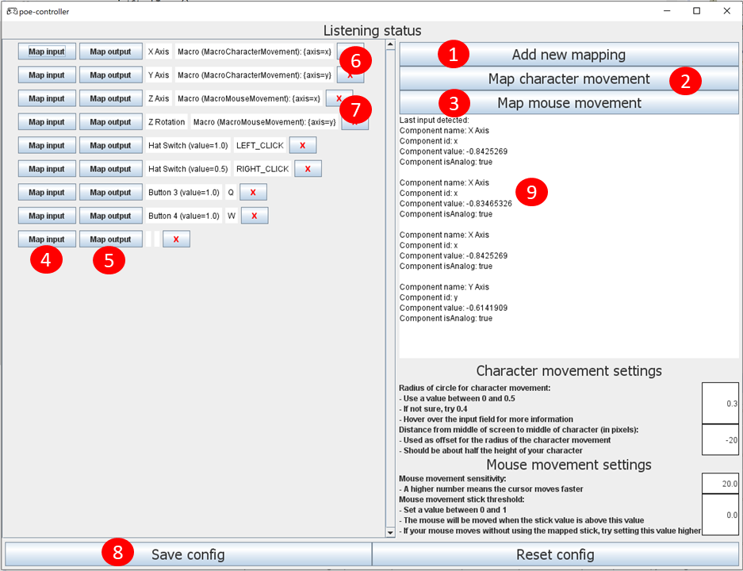
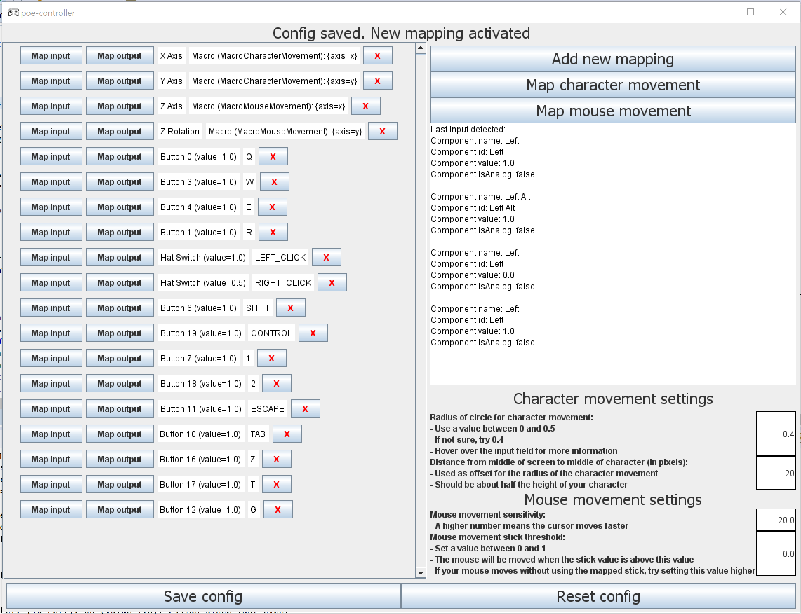

<!-- omit in toc -->
# poe-controller

Play Path of Exile with a controller! 

- [Features](#features)
- [Requirements](#requirements)
- [Installation](#installation)
- [Setup](#setup)
  - [Map controller joysticks to character and mouse movement](#map-controller-joysticks-to-character-and-mouse-movement)
  - [Map controller buttons to keyboard or mouse outputs](#map-controller-buttons-to-keyboard-or-mouse-outputs)
- [FAQ & Troubleshooting](#faq--troubleshooting)
  - [Help, the application froze! Or: The application is not responding as expected!](#help-the-application-froze-or-the-application-is-not-responding-as-expected)
  - [Mappings are not working as expected when playing PoE.](#mappings-are-not-working-as-expected-when-playing-poe)
  - ['java' is not recognized as an internal or external command, operable program or batch file](#java-is-not-recognized-as-an-internal-or-external-command-operable-program-or-batch-file)
  - [The mouse is moving on its own!](#the-mouse-is-moving-on-its-own)
  - [How can I change a setting without the user interface?](#how-can-i-change-a-setting-without-the-user-interface)
  - [What happens to my data?](#what-happens-to-my-data)
  - [How do I retrieve a detailed log?](#how-do-i-retrieve-a-detailed-log)
  - [The log file is very large!](#the-log-file-is-very-large)
  - [I would like to report a bug!](#i-would-like-to-report-a-bug)
  - [How can I contact you?](#how-can-i-contact-you)
- [Development setup](#development-setup)
  - [IDE setup](#ide-setup)
  - [Packaging and starting the application](#packaging-and-starting-the-application)
  - [Command line parameters](#command-line-parameters)
- [Gameplay and sample mapping](#gameplay-and-sample-mapping)
- [License](#license)
- [Open source software and attributions](#open-source-software-and-attributions)


# Features
- Map controller joysticks to character and mouse movement
- Map controller buttons to keyboard keys and mouse clicks
- Health: Reduce the risk of RSI by using a more ergonomic method of playing PoE! 

Character movement:<br>Joystick moves mouse in<br> circle around character  |  Mouse movement: <br>Joystick moves mouse<br>arbitrarily | Controller button<br>is mapped to<br>mouse click | Controller button<br> is mapped to<br> keyboard
:-------------------------:|:-------------------------:|:-------------------------:|:-------------------------:
 |  |  | 


# Requirements
- [Java 64-bit](https://www.java.com/en/download/manual.jsp) (minimum version 8): Make sure you chose the 64-bit version
- A controller

# Installation
- Download the latest release [here](https://github.com/Zhadok/poe-controller/releases)
- Unpack `poe-controller-{version}.zip` to your folder of choice
- Execute the file `start-poe-controller.cmd`

# Setup
This section describes how to map controller inputs to keyboard/mouse outputs. 
See [here](#gameplay-and-sample-mapping) for an example of a full mapping. 

<a href="ui-screenshot"></a>



## Map controller joysticks to character and mouse movement

- Click on (2): `Map character movement` 
  - Move the joystick in a circle.
  - Two mappings should be assigned with the output `MacroCharacterMovement` (6)
- Click on (3): `Map mouse movement`.
  - Move the joystick in a circle.
  - Two mappings should be assigned with the output `MacroMouseMovement` (7)
- Click on (8): `Save config`. 
- **Note**: poe-controller will do its best to automatically recognize which events belong to which controller axis. **However**: If the automatic mapping fails please retry. If it still fails please try [manually changing settings.](#how-can-i-change-a-setting-without-the-user-interface)

## Map controller buttons to keyboard or mouse outputs
Repeat for each controller button you want to map: 

- Click on (1): `Add new mapping`
- Click on (4): `Map input`
- Hit a button on your controller.
- Click on (5): `Map output`
- Click your mouse or hit a key. 
- Click on (8): `Save config`.

Suggestions: 
- Map `L1` or `R1` to `Shift`: This gives you access to the second skill bar
- Map `L2` or `R2` to `Control`: Useful for `Control+Click` on items
- Map `A` (XBox One) or `X` (PS4) to your movement skill for the full console experience


# FAQ & Troubleshooting

## Help, the application froze! Or: The application is not responding as expected! 
Please try restarting the application. 

## Mappings are not working as expected when playing PoE.
**Important**: Steam has two places where you can enable/disable controller remappings

- Globally: Steam -> Settings -> Controller -> General Controller Settings -> Uncheck needed boxes. I also unchecked `Guide Button Focuses Steam`
- Per-game: Try turning it off for PoE. See [here](https://support.rocketleague.com/hc/en-us/articles/360022354994-How-do-I-Disable-Steam-Controller-Configuration-) for a guide  
- Make sure you don't have any other remapping software running
- This programm should only be running once


## 'java' is not recognized as an internal or external command, operable program or batch file
Make sure you have [installed Java](https://www.oracle.com/java/technologies/javase-downloads.html) (minimum version 8). I have tested the program with Java 8 and Java 11. You can use `java -version` in a command line to check your installed Java version.

## The mouse is moving on its own! 
Try increasing the mouse movement stick threshold. The threshold can be set in the input field on the bottom right. 


## How can I change a setting without the user interface?
**Note**: Having knowledge of [JSON](https://www.w3schools.com/whatis/whatis_json.asp) is probably required for these steps.  

1) Close the application. 
1) The application settings are stored under `poe-controller-files/settings.json`. 
1) Each row in the UI is an object in the `configs[0].mapping` array
1) A mapping consists of a `mappingKey` and an `action`. 
1) Change mapping **input**: You will need to change the `mappingKey`. 
   1) For digital buttons on the controller you will require the fields `componentName`, `id` and `valueWhenPressed`. `analog` should be set to `false` (no quotes). See (9) in the [UI screenshot](#ui-screenshot) for an example.
   1) For analog joysticks you will require the fields `componentName` and `id`. `valueWhenPressed` should be set to `null` and `analog` should be set to `true` (no quotes). See (10) in the [UI screenshot](#ui-screenshot) for an example. 
1) Change mapping **output**: You will need to change the `action`.
   1) Mouse click: `mouseAction` should be set to `"LEFT_CLICK"`, `"MIDDLE_CLICK"` or `"RIGHT_CLICK"`.  
   1) Keyboard key: `key` should be set to the uppercase key, for example `A` or `SHIFT`. 
   1) Character/mouse movement: These structures are more complex. I would recommend checking the [default settings file](https://github.com/Zhadok/poe-controller/blob/master/src/main/resources/default_settings.json). You are looking for a `macro` where the `name` is set to `"MacroCharacterMovement"` or `"MacroMouseMovement"`. 


## What happens to my data? 
All of your data stays local. 


## How do I retrieve a detailed log?
1) The application can be started with different levels of [verbosity](#command-line-parameters). Open the file `start-poe-controller.cmd` and change the number in `-Dverbosity=1` to `3`. 
1) Reproduce the bug and close the program quickly to make the search easier. 
1) The log can be found in your installation folder under `poe-controller-files/poe-controller.log`. 
1) Note that you should change it back to `1` for normal play, otherwise the file will keep growing quickly.


## The log file is very large!
The log file `poe-controller-files/poe-controller.log` can be deleted safely. 
Try decreasing the [verbosity](#command-line-parameters). 

## I would like to report a bug!
Sure! Feel free to [contact me](#how-can-i-contact-you), but please 
- check the list of existing [issues](https://github.com/Zhadok/poe-controller/issues)
- [prepare a log file](#how-do-i-retrieve-a-detailed-log) which was recorded when the bug occured


## How can I contact you?
You can reach me on discord under Zhadok#3311. If you would like to report a bug, please prepare and send me the [detailed log file](#how-do-i-retrieve-a-detailed-log). 


# Development setup
## IDE setup
Run the following command once if you want to run the application via an IDE. This will unpack the neccessary native files (.dll) from the Maven dependency.  
```
mvn nativedependencies:copy
```
Then, run the class `org.zhadok.poe.controller.App`.


## Packaging and starting the application
Run the following commands to package and start the jar file (remember to insert the correct version): 
```
mvn clean nativedependencies:copy package
java -D"java.library.path"="./poe-controller-files/lib" -jar target/poe-controller-{version}.jar
```

## Command line parameters
You can set a parameter when starting the jar file: 
```
-D"{parameter}"="{value}"
```
For example, you can increase the verbosity by starting the jar file with `-Dverbosity=2`. 

Available parameters: 
- `verbosity` (Default 1): Increase or decrease the logging output. A higher verbosity means more output. 
- `java.library.path`: Required for locating the native files


# Gameplay and sample mapping
This is the mapping I play PoE with. 



Sample gameplay


# License
Apache License Version 2.0

# Open source software and attributions
- [JInput](https://jinput.github.io/jinput/): Copyright 2019 jinput
- Controller icon made by [Good Ware](https://www.flaticon.com/authors/good-ware") from [Flaticon](https://www.flaticon.com/)


